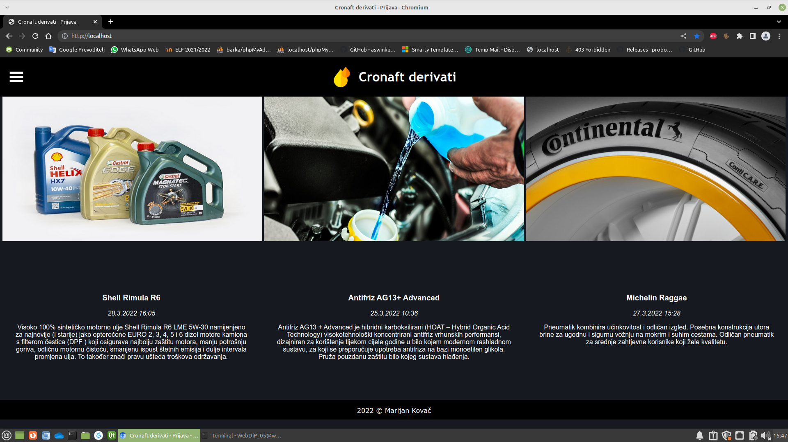
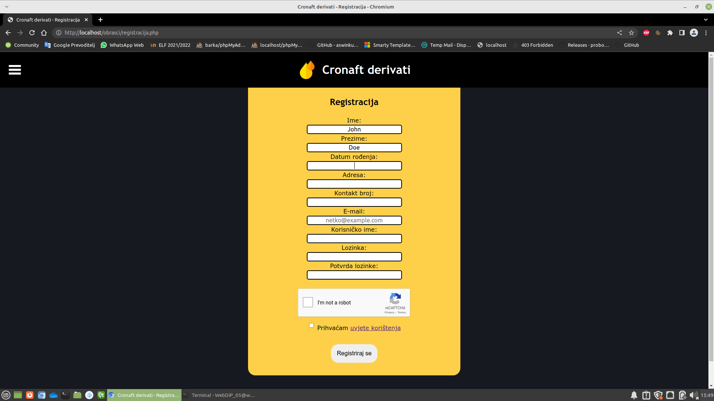
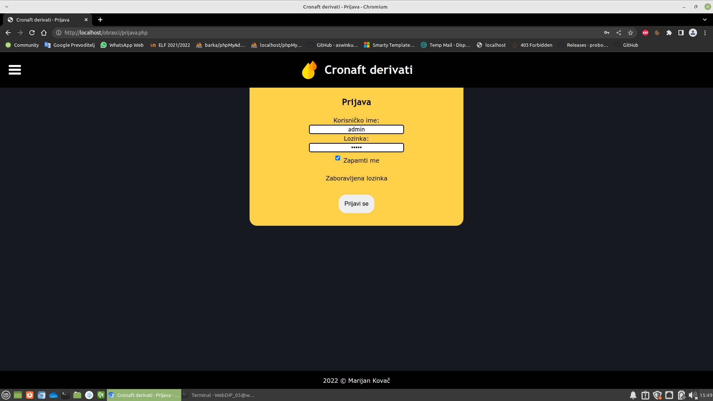
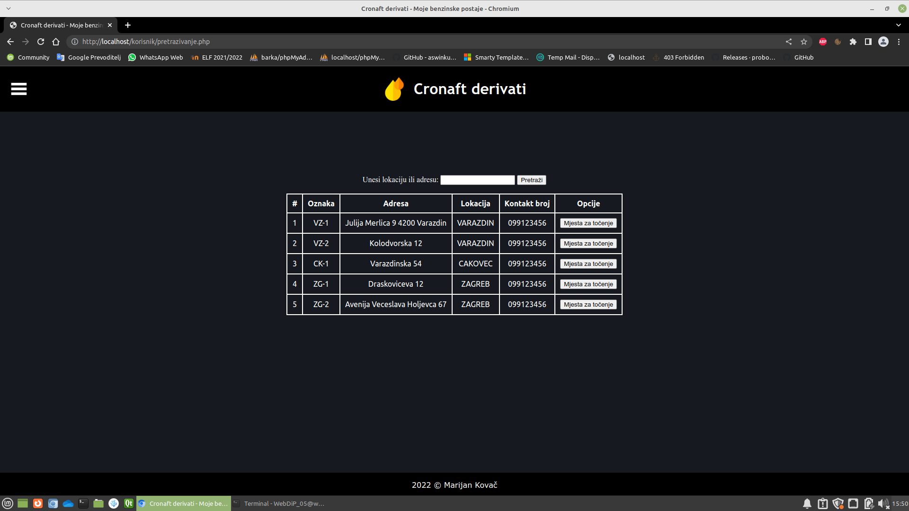
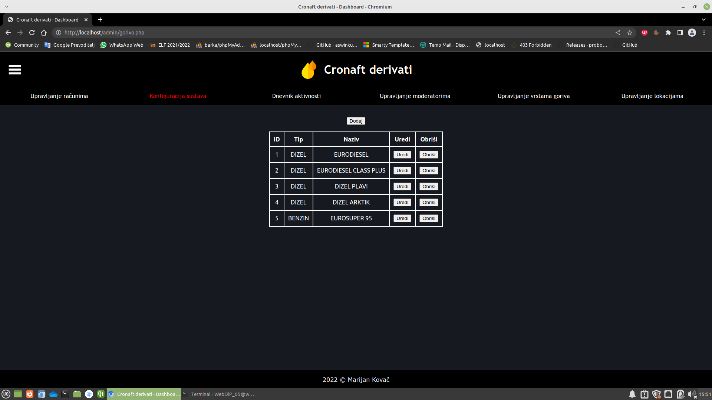
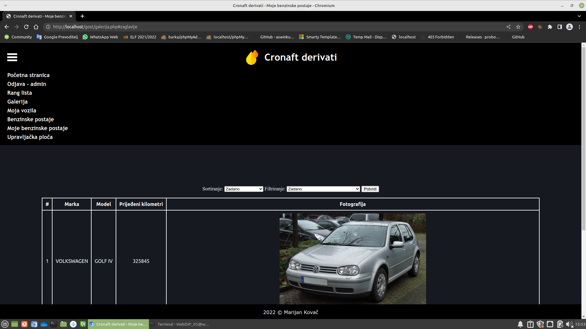

<a name="readme-top"></a>

<div align="right">
<a href="./README.en.md"></a>
</div>

<!-- INTRO --> 
<br />
<div align="center">
  
  

  <h3 align="center">Benzinska postaja</h3>

  <p align="center">
    Projekt iz kolegija Web dizajn i programiranje
    <br /> 
    <a href="https://nastava.foi.hr/course/72633"><strong>Saznajte više »</strong></a>
    <br />

  </p>

  <br>
  
  <!-- TABLE OF CONTENTS -->

  <a href="#-uvod">Uvod</a> • 
  <a href="#-opis-projekta">Opis projekta</a> • 
  <a href="#-konfiguracija">Konfiguracija</a> • 
  <a href="#-upotreba">Upotreba</a> • 
  <a href="#-korišteni-alati">Korišteni alati</a>
</div>

<br>

<!-- ABOUT THE PROJECT -->
## 📖 Uvod

### Općenito

<table>
  <tbody>
    <tr>
      <td>👦🏽 Autor</td>
      <td>Marijan Kovač</td>
    </tr>
    <tr>
      <td>🧑🏽‍🏫 Nastavnici</td>
      <td>Prof. dr. sc. Dragutin Kermek <br>
      Matija Kaniški, mag. inf. <br>
      Iva Levak, mag. inf.</td>
    </tr>
    <tr>
      <td>📚 Kolegij</td>
      <td>Web dizajn i programiranje</td>
    </tr>
    <tr>
      <td>🏛️ Ustanova</td>
      <td>Sveučilište u Zagrebu <br> Fakultet organizacije i informatike <br> Varaždin</td>
    </tr>
    <tr>
      <td>📆 Godina <br>polaganja</td>
      <td>2022</td>
    </tr>
  </tbody>
</table>

<p align="right">(<a href="#readme-top">povratak na vrh</a>)</p>

## 📝 Opis projekta

Sustav služi za upravljanje benzinskom postajom i evidenciju potrošnje goriva.

Uloge:

  * Neregistrirani korisnik
  * Registrirani korisnik
  * Moderator
  * Administrator

Korisnički zahtjevi:

  * Administrator
    * Kreira/Pregledava/Ažurira lokacije benzinskih postaja (Varaždin, Čakovec, Zagreb, …) i dodjeljuje moderatore benzinskim postajama.
    * Kreira/Pregledava/Ažurira vrste goriva (Eurosuper 95, Dizel, …)
    
  * Moderator
    * Kreira/Pregledava/Ažurira pridružuje vrste goriva za benzinsku postaju za koju je zadužen. Za svaku vrstu goriva unosi cijenu goriva, količinu. Određuje status pojedinog goriva (na raspolaganju i nije na raspolaganju). Automatski se određuje status goriva nije na raspolaganju ako je količina na 0.
    * Kreira/Pregledava/Ažurira mjesta na benzinskoj postoji za koju je zadužen i odabire vrste goriva koje su dodijeljene toj bezinskoj postoji i mogu se puniti na tom mjestu. Određuje status mjesto (zatvorena, otvorena, u kvaru, čeka naplatu).
    * Vidi popis goriva i ukupnu količinu raspoloživog goriva (posebno su označena goriva koja imaju količinu 0).
    * Potvrđuje plaćenost i status mjesta se automatski postavlja u otvoreno.
    * Vidi statistiku točenja goriva grupirano po korisniku.

  * Registrirani korisnik
    * Kreira/Pregledava/Ažurira vozila i za odabrano vozilo unosi registraciju, marku, model, trenutna vrijednost brojača prijeđeni kilometri i postavlja sliku svojeg vozila.
    * Pretražuje sve benzinske postaje i gorivo. Izlistavanjem se vidi status pojedinog goriva na benzinskoj postaji. Odabirom benzinske postaje vidi otvorena mjesta za odabranu vrstu goriva.
    * Za odabranu mjesto može evidentirati točenje goriva na način da odabire vozilo, vrstu goriva (koja su dodijeljena tom mjestu) te unese novo stanje prijeđenih kilometara i koliko je potrošio goriva, količinu goriva koju je preuzeo (automatski se smanjuje ukupna količina goriva na benzinskoj postaji i automatski se unosi status benzinskog mjesta čeka naplatu).
    * Pregledava statistiku pređenih kilometara i/ili potrošnju (l/100km) za odabrano vozilo.

  * Neregistrirani korisnik
    * Vidi rang listu benzinskih postaja prema ukupnoj količini natočenog goriva s informacijom o cijeni goriva u vremenskom razdoblju (od-do).
    * Vidi galeriju slika vozila uz mogućnost sortiranja trenutnoj vrijednosti brojača prijeđenih kilometara ili modelu i može filtrirati po benzinskoj postaji.

<br>

Za detaljan opis projekta kliknite <a href="./Documentation/Benzinska postaja.pdf"><strong>ovdje</strong></a>.

Za detaljan opis funkcionalnosti klinite <a href="./Documentation/Opće upute v1.0.pdf"><strong>ovdje</strong></a>.

<p align="right">(<a href="#readme-top">povratak na vrh</a>)</p>

## ⚙️ Konfiguracija

### Preduvjeti

Za pokretanje rješenja bit će vam potrebno sljedeće:

* Operativni sustav Linux (preporuka)
  
  Za izradu rješenja korišten je <a href="https://linuxmint.com/">Linux Mint</a> na <a href="https://www.virtualbox.org/">Oracle VirtualBox VM</a>. 

* LAMP (Apache, MySQL, PHP) + phpmyadmin:
  ```bash
  ⚠️ NAPOMENA: Za izradu projekta korištene verzije alata su sljedeće:


  ```

  * Instalirajte LAMP:

    ```bash
    sudo apt-get update
    sudo apt-get install -y tasksel
    sudo tasksel install lamp-server
    ```

    Time će se instalirati svi potrebni alati u paketu. Za više informacija kliknite <a href="https://ubuntu.com/server/docs/get-started-with-lamp-applications"><strong>ovdje</strong></a>.

  * Moguće je i pojedinačno instalirati potrebne alate:

    ⚠️ Preskočiti ovaj korak ako je instaliran LAMP

    * Instalirajte apache2 server:

      ```bash
      sudo apt-get install apache2
      ```

    * Instalirajte mysql:

      ```bash
      sudo apt-get install mysql-server
      ```

    * Instalirajte php:

      ```bash
      sudo apt-get install php
      ```

  * Sada se može instalirati phpmyadmin:

      ```bash
      sudo apt install phpmyadmin
      ```

    * Nakon instalacije posjetite

      ```bash
      localhost/phpmyadmin
      ```

    * Zadani podaci za prijavu su:

      ```bash
      username: root
      password: root
      ```
* Smarty template:

  * Preuzmite <a href="https://github.com/smarty-php/smarty/releases/tag/v4.0.0"><strong>Smarty v4.0.0</strong></a>

  * Preuzetu mapu `smarty-4.0.0` smjestiti u direktorij `vanjske_biblioteke`

<br>

### Priprema

  * Klonirajte ovaj repozitorij:

    ```bash
    https://github.com/mkovac700/webdip.git
    ```

  * Smjestite datoteke izvornoga koda (sadržaj mape `Software`) u sljedeći direktorij:

    ```bash
    /var/www/html
    ```

  * Pokrenite `apache2` i `mysql`

    Potrebno je otvoriti terminal i izvršiti slijedeće komande:

    ```bash
    service apache2 start
    service mysql start
    ```

  * Otvoriti u pregledniku `http://localhost/phpmyadmin/` i napraviti slijedeće:

    * za username i password unijeti `root`
    * kreirati novu bazu podataka pod nazivom `WebDiP2021x051` (⚠️ važno je da naziv baze bude identičan)
    * importati (ili kopirati) SQL skriptu `WebDiP2021x051.sql` iz mape `Software` te ju izvršiti

<p align="right">(<a href="#readme-top">povratak na vrh</a>)</p>

## 🚀 Upotreba

  * Pokrenuti `apache2` i `mysql` (ako nisu pokrenuti)

    Potrebno je otvoriti terminal i izvršiti slijedeće komande:

    ```bash
    service apache2 start
    service mysql start
    ```

  * Otvoriti u pregledniku `http://localhost/`

  * Početna stranica: 

    <br>

    <div align="center">
      <a href="./Documentation/Screenshot_2023-08-03_15-47-32.png"></a>
    </div>

    <br>

  * Registracija:

    <br>

    <div align="center">
      <a href="./Documentation/Screenshot_2023-08-03_15-49-18.png"></a>
    </div>

    <br>

  * Prijava:

    <br>

    <div align="center">
      <a href="./Documentation/Screenshot_2023-08-03_15-49-40.png"></a>
    </div>

    <br>

  * Pretraživanje benzinskih postaja (uloga `korisnik`):

    <br>

    <div align="center">
      <a href="./Documentation/Screenshot_2023-08-03_15-50-23.png"></a>
    </div>

    <br>

  * Upravljanje vrstama goriva (uloga `administrator`):

    <br>

    <div align="center">
      <a href="./Documentation/Screenshot_2023-08-03_15-51-21.png"></a>
    </div>

    <br>

  * Galerija vozila:

    <br>

    <div align="center">
      <a href="./Documentation/Screenshot_2023-08-03_15-53-42.png"></a>
    </div>

    <br>

<p align="right">(<a href="#readme-top">povratak na vrh</a>)</p>

## ⛏️ Korišteni alati

<div align="center">
  
  
   &nbsp;
  

   
   &emsp;
       
          
</div>

<p align="right">(<a href="#readme-top">povratak na vrh</a>)</p>


